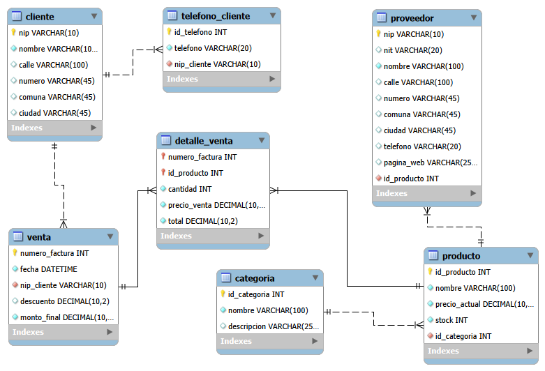

# Base de datos relacional – Import Tech SAS
Proyecto desarrollado como parte del curso **\*\*Construcción de bases de datos con MySQL\*\*** del SENA.

El ejercicio parte del caso de estudio Import Tech SAS y tiene como propósito aplicar los conceptos básicos del diseño y construcción de una base de datos relacional utilizando MySQL Server y MySQL Workbench.

## ¿Qué desarrollé?

A partir de los requerimientos del caso de estudio diseñé un modelo relacional compuesto por siete tablas:

- `cliente`
- `telefono\_cliente`
- `categoria`
- `producto`
- `proveedor`
- `venta`
- `detalle\_venta`

Durante el desarrollo trabajé conceptos como entidades y atributos, claves primarias y foráneas, relaciones 1:N y N:M, atributos multivaluados, claves primarias compuestas, tipos de datos y restricciones de integridad referencial.

El modelo fue construido mediante un diagrama EER en MySQL Workbench y posteriormente llevado a MySQL Server mediante Forward Engineering.

## Modelo EER

El siguiente diagrama representa la estructura relacional diseñada para el caso de estudio:

## Estructura del repositorio

El repositorio está organizado de la siguiente manera:

- `modelo/import_tech_sas.mwb`: modelo original desarrollado en MySQL Workbench. Contiene el diagrama EER, las tablas y las relaciones definidas durante el diseño.
- `sql/import_tech_sas.sql`: script SQL exportado desde MySQL Workbench. Permite reconstruir la estructura de la base de datos en MySQL.
- `documentacion/modelo_eer_import_tech.png`: representación gráfica del modelo EER utilizada para documentar el proyecto.

## Herramientas utilizadas

- MySQL Server 8.0
- MySQL Workbench 8.0
- SQL

## Aprendizajes

Este proyecto corresponde a mi primera experiencia en el diseño y construcción de una base de datos relacional con MySQL.

Durante su desarrollo comprendí, entre otros aspectos:

- La diferencia entre una entidad, un atributo y una tabla.
- La función de las claves primarias (PK) y claves foráneas (FK).
- Cómo representar relaciones uno a muchos y resolver una relación muchos a muchos mediante una tabla intermedia.
- Por qué un dato compuesto únicamente por números no necesariamente debe almacenarse como un tipo numérico.
- La importancia de seleccionar tipos de datos adecuados, como `DECIMAL` para valores monetarios.
- Cómo pasar de los requerimientos de un caso a un modelo EER.
- Cómo utilizar Forward Engineering para convertir el modelo diseñado en una estructura real de tablas y relaciones en MySQL Server.
- Cómo verificar mediante SQL que la estructura creada corresponde con el diseño realizado.

Este repositorio hace parte de mi proceso de formación en análisis y desarrollo de software y documenta el avance desde los conceptos iniciales de bases de datos hasta la construcción de un primer modelo relacional funcional.
